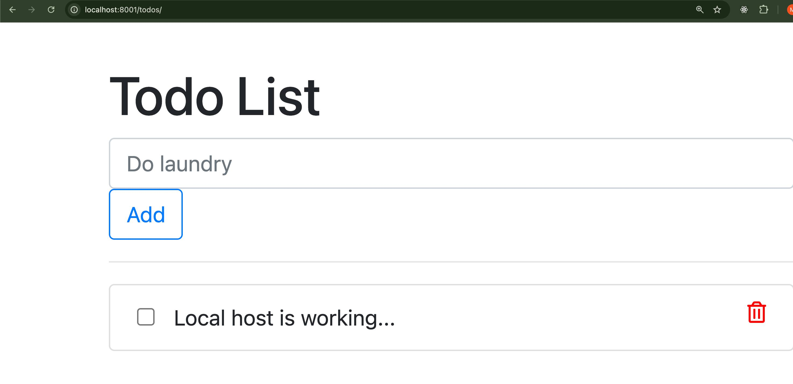
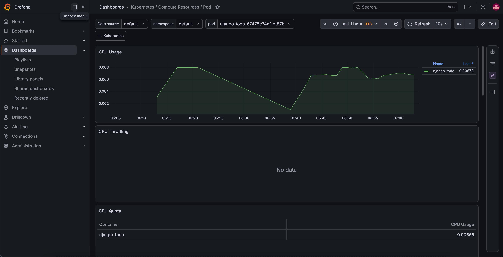

# Django Todo App — Full DevOps Pipeline

A complete production-style DevOps pipeline built around a Django todo web application. This project covers the full journey from source code to a live, monitored deployment on AWS.

---

## 🚀 Pipeline Overview

```
Code Push → GitHub Actions → Docker Build → Docker Hub → Kubernetes (Helm) → AWS EC2 (Terraform)
                                                                    ↓
                                                         Prometheus + Grafana Monitoring
```

---

## 🛠️ Tech Stack

| Tool | Purpose |
|---|---|
| **Django** | Web application framework |
| **Docker** | Containerization |
| **Docker Hub** | Container image registry |
| **GitHub Actions** | CI/CD pipeline automation |
| **Kubernetes (KIND)** | Container orchestration |
| **Helm** | Kubernetes package manager |
| **Terraform** | Infrastructure as Code |
| **AWS EC2** | Cloud server |
| **Prometheus** | Metrics collection |
| **Grafana** | Monitoring dashboards |

---

## 📁 Project Structure

```
django-todo/
├── .github/
│   └── workflows/
│       └── ci.yml          # GitHub Actions CI/CD pipeline
├── helm/
│   └── django-todo/
│       ├── Chart.yaml       # Helm chart metadata
│       ├── values.yaml      # Configurable values
│       └── templates/
│           ├── deployment.yaml   # Kubernetes Deployment
│           └── service.yaml      # Kubernetes Service
├── terraform-django/
│   ├── providers.tf         # AWS provider configuration
│   ├── terraform.tf         # Terraform version requirements
│   ├── ec2.tf               # EC2 instance + security group
│   ├── variables.tf         # Input variables
│   └── outputs.tf           # Output values (IP, URL)
├── todoApp/                 # Django app settings
├── todos/                   # Todo app logic
├── Dockerfile               # Container build instructions
├── requirements.txt         # Python dependencies
└── manage.py                # Django management script
```

---

## ⚙️ How It Works

### 1. Dockerfile
The app is containerized using a Python 3.12 slim base image. The Dockerfile:
- Installs all dependencies from `requirements.txt`
- Runs database migrations automatically
- Starts Django on port 8001

### 2. GitHub Actions CI/CD
Every push to the `develop` branch automatically:
- Sets up Python environment
- Installs dependencies
- Logs into Docker Hub using GitHub Secrets
- Builds a fresh Docker image
- Pushes it to Docker Hub

### 3. Kubernetes + Helm
The app is deployed onto a Kubernetes cluster using a custom Helm chart with:
- A `Deployment` managing pod replicas
- A `NodePort` Service exposing the app
- All values configurable through `values.yaml`

### 4. Terraform + AWS
Infrastructure is provisioned as code:
- EC2 instance (`t3.micro`) with a security group
- Ports 22 (SSH) and 8001 (Django) open
- `user_data` script automatically installs Docker and runs the container on first boot
- Public IP printed as output after deployment

### 5. Prometheus + Grafana
Full monitoring stack installed via Helm:
- Prometheus scrapes metrics from all pods every 15 seconds
- Grafana visualizes CPU usage, memory usage, and pod health
- Pre-built Kubernetes dashboards available out of the box

---

## 🚦 Getting Started

### Prerequisites
- Docker
- kubectl
- Helm
- KIND
- Terraform
- AWS CLI configured

### Run locally
```bash
git clone https://github.com/nomandev1011/django-todo.git
cd django-todo
pip3 install -r requirements.txt
python3 manage.py migrate
python3 manage.py runserver
```
Visit `http://127.0.0.1:8000/todos`

### Deploy to Kubernetes locally
```bash
# Create KIND cluster
kind create cluster --name django-cluster

# Deploy app
helm install django-todo ./helm/django-todo

# Access app
kubectl port-forward svc/django-todo 8001:8001
```
Visit `http://localhost:8001/todos`

### Deploy to AWS with Terraform
```bash
cd terraform-django
terraform init
terraform apply
```
Visit the URL printed in the output.

### Install monitoring
```bash
helm repo add prometheus-community https://prometheus-community.github.io/helm-charts
helm install monitoring prometheus-community/kube-prometheus-stack -n monitoring --create-namespace

# Access Grafana
kubectl --namespace monitoring port-forward svc/monitoring-grafana 3000
```
Visit `http://localhost:3000` (username: `admin`)

---

## 🔒 Security Notes
- AWS credentials are never stored in code — configured via `aws configure`
- Docker Hub credentials stored as GitHub Secrets
- `.pem` key files excluded via `.gitignore`
- Terraform state files excluded via `.gitignore`

---

## 📊 Monitoring
After installing the monitoring stack, access these Grafana dashboards:
- **Kubernetes / Compute Resources / Pod** — CPU and memory per pod
- **Kubernetes / Compute Resources / Cluster** — overall cluster health
- **Alertmanager / Overview** — alert status

---

## 🧹 Cleanup
```bash
# Remove Kubernetes deployments
helm uninstall django-todo
helm uninstall monitoring -n monitoring
kind delete cluster --name django-cluster

# Destroy AWS infrastructure
cd terraform-django
terraform destroy -auto-approve
```

---


## 📸 Screenshots

### Live Todo App


### EC2-instance


### Kubernetes Pods Running


### Grafana Monitoring Dashboard


---

## 👨‍💻 Author
**Muhammad Noman** — [@nomandev1011](https://github.com/nomandev1011)


